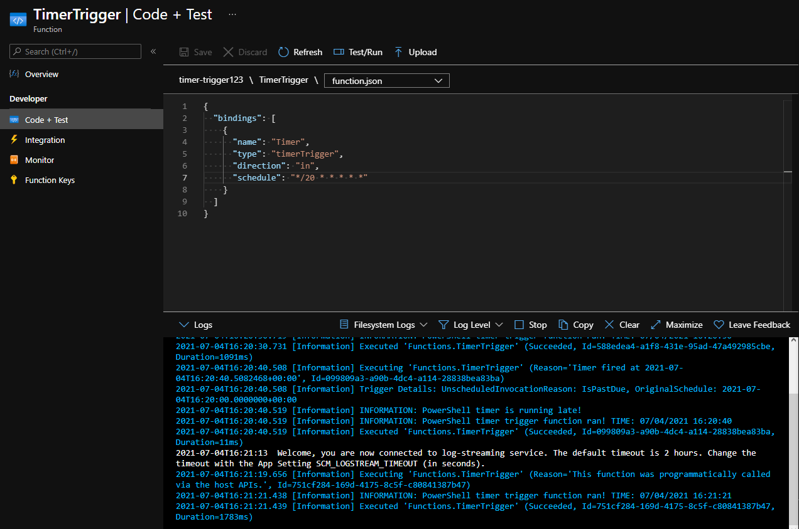

# cloud-journey-2021
This repo is about all the cloud-related topics I've been working on since July 1.

# Goals
- Certifications and trainings
  - Complete [Exam AZ-204: Developing Solutions for Microsoft Azure](https://docs.microsoft.com/en-us/learn/certifications/exams/az-204)
  - Participate in my employer's __Cloud Architect Program__
  - Complete Udacity's [SUSE Cloud Native Foundations Scholarship Program](https://www.udacity.com/scholarships/suse-cloud-native-foundations-scholarship)
  - Complete Udacity's [AWS Machine Learning Scholarship Program](https://www.udacity.com/scholarships/aws-machine-learning-scholarship-program)
- Books
  - [Learn Azure in a Month of Lunches](https://azure.microsoft.com/en-us/resources/learn-azure-in-a-month-of-lunches/)
  - [Azure for Architects](https://azure.microsoft.com/en-us/resources/azure-for-architects/)
  - [
The Developer’s Guide to Azure
](https://azure.microsoft.com/en-us/campaigns/developer-guide/)

# Diary
## Day 1 - July 1
- Set up this repository
- Defined above goals

## Day 2 - July 2
- AZ-204: Started learning path [Create serverless applications](https://docs.microsoft.com/en-us/learn/paths/create-serverless-applications/)
    

    
Module: Choose the best Azure service to automate your business processes

  - Learned about different Azure technology options (Logic Apps, Microsoft Power Automate, WebJobs, Azure Functions)
  - All four technologies can
    - accept inputs
    - can run actions
    - can include conditions
    - can produce outputs
    - can be triggered based on a schedule or by an external event
  - [How to choose a service](https://docs.microsoft.com/en-us/learn/modules/choose-azure-service-to-integrate-and-automate-business-processes/3-analyze-the-decision-criteria)
  
    

## Day 3 - July 3
- AZ-204: Continued learning path [Create serverless applications](https://docs.microsoft.com/en-us/learn/paths/create-serverless-applications/)
    

    
Module: Create serverless logic with Azure Functions

  - Learned about the benefits and drawbacks of serverless compute solutions
    - \+ no need to provision VM servers
    - \+ stateless logic
    - \+ event driven
    - \- execution time
    - \- execution frequency
  - Created a function app in Azure Portal
  
    

## Day 4 - July 4
- AZ-204: Continued learning path [Create serverless applications](https://docs.microsoft.com/en-us/learn/paths/create-serverless-applications/)
    

    
Module: Execute an Azure Function with triggers

  - Learned about triggers for Azure Functions
    - Types of triggers
      - Timer
      - HTTP
      - Blob
      - Queue
      - Azure Cosmos DB
      - Event Hub
    - [CRON expression](https://github.com/atifaziz/NCrontab) for a timer trigger
  - Created a function app with a timer trigger in Azure Portal
  
  - Created a function app with a blob trigger in Azure Portal
  
    

 